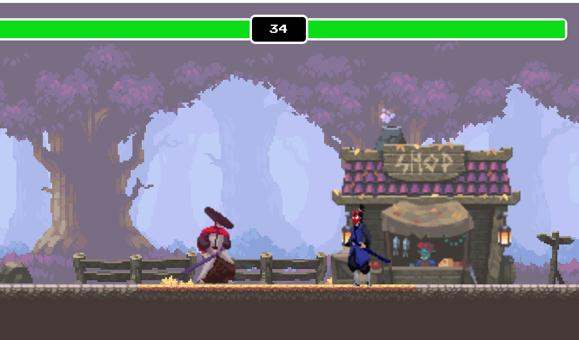

# Samurai Fighter Game

             

Welcome to Samurai Fighter, a two-player game where players engage in epic battles as skilled samurai warriors!

## How to Play

             

1. **Objective:** Defeat your opponent by reducing their health to zero.

2. **Controls:**
   - Player 1:
     - Move Left: A Key
     - Move Right: D Key
     - Move Up: W Key
     - Attack: Spacebar
   - Player 2:
     - Move Left: Left Arrow Key
     - Move Right: Right Arrow Key
     - Move Up: Up Arrow Key
     - Attack: Down Arrow Key
   
3. **Gameplay:**
   - Players control their samurai characters using the arrow keys (Player 1) or A/D keys (Player 2).
   - Press the designated attack key to strike your opponent.
   - Avoid your opponent's attacks while trying to land your own strikes to reduce their health.
   - The first player to reduce their opponent's health to zero wins the round.

4. **Scoring:**
   - Each successful attack reduces the opponent's health.
   - The player with remaining health at the end of the round earns a point.
   - The first player to reach a certain number of points (e.g., 5) wins the game.\
   - Visit https://quicksilver-lab.github.io/Samurai-Fighter/

## Technologies Used

             

- HTML/CSS/JavaScript

## Contributing

             

Contributions are welcome! If you have any ideas for improvements or new features, feel free to submit a pull request.

## License

             

This project is licensed under the [MIT License](LICENSE).

